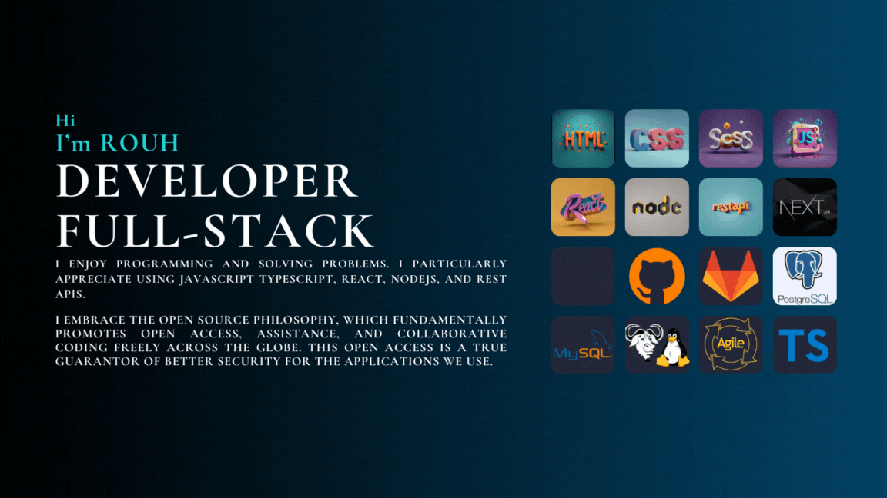

 [portfolio](https://portfolio-parallax-rouh.vercel.app/) | [CodeWars](https://www.codewars.com/users/Huor97) | [RootMe](https://www.root-me.org/rouh?lang=fr#d448dc8023e26641552040420a82df75) | [Repository](https://github.com/Huor97?tab=repositories)

    
    

    
