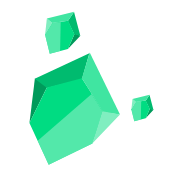
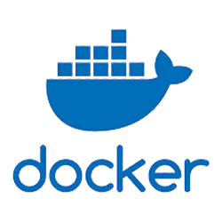

# Hi I’m ROUH, Develpper Full-Stack 

I enjoy programming and solving problems. I particularly appreciate using Vue3, Nuxt3.

I embrace the Open Source philosophy, which fundamentally promotes open access, assistance, and collaborative coding freely across the globe. This open access is a true guarantor of better security for the applications we use. 

 

 
 
 

 [portfolio](https://portfolio-parallax-rouh.vercel.app/) | [CodeWars](https://www.codewars.com/users/Huor97) | [RootMe](https://www.root-me.org/rouh?lang=fr#d448dc8023e26641552040420a82df75) | [Repository](https://github.com/Huor97?tab=repositories)

## Technical knowledge
- React
- Pinia/Vuex
- Three.js
- Node.js
- Python
- API REST
- PostgreSQL • Supabase • Firebase

