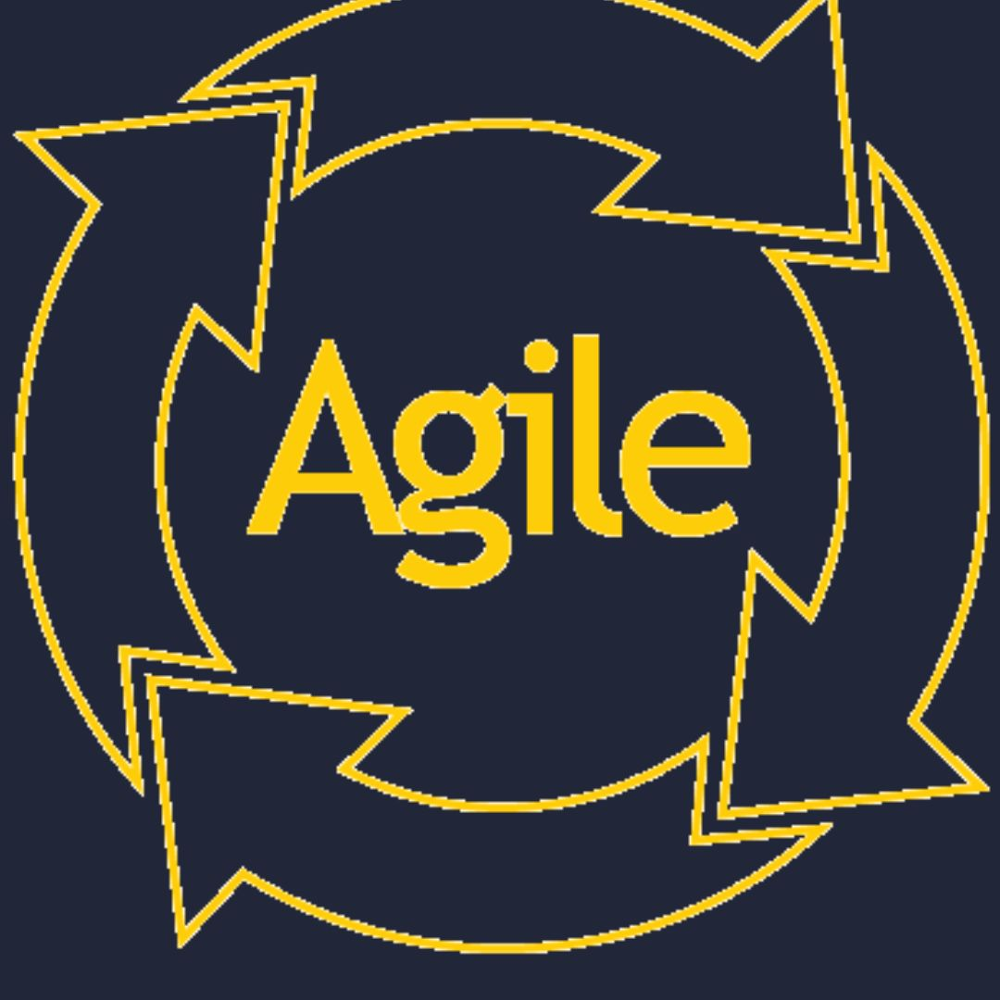

    
    I'm
    
     
    
    Rouh
    
     
    
    Full-Stack Developer
    
     
     
    
    I enjoy programming and solving problems. I particularly appreciate using JavaScript/TypeScript, React, NodeJS, and Rest APIs.
    
     
    
    I embrace the Open Source philosophy, which fundamentally promotes open access, assistance, and collaborative coding freely across the globe. This open access is a true guarantor of better security for the applications we use.
    

    links you need :
    

-   [Portfolio](https://portfolio-parallax-rouh.vercel.app/)
-   [Repositories](https://github.com/Huor97?tab=repositories)
-   [CodeWars](https://www.codewars.com/users/Huor97)
-   [Root-me](https://www.root-me.org/rouh?lang=fr#d448dc8023e26641552040420a82df75)

    

        
    

  

        
    

  

        
    

  

        
  

<!-- ========================================== -->

  

        
    

  

        
    

  

        
    

  

        
    

  <!-- ==================================== -->
  

        
    

  

        
    

  

        
    

  

        
    

  

        
    

  <!-- ==================================== -->

  

        
    

  

        
    

  

        
    

